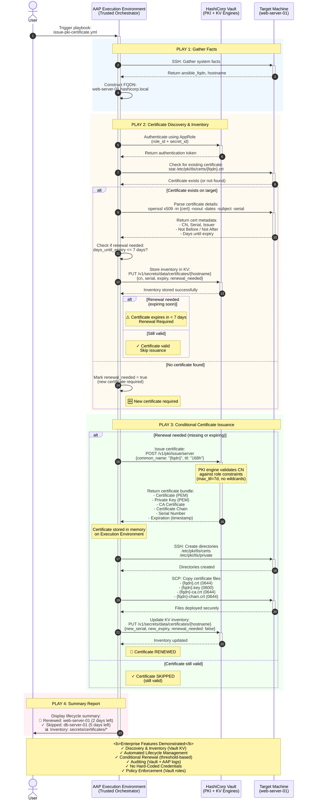

```mermaid
sequenceDiagram
    autonumber

    %% Participants
    actor User
    participant AAP as AAP Execution Environment<br/>(Trusted Orchestrator)
    participant Vault as HashiCorp Vault<br/>(PKI + KV Engines)
    participant Target as Target Machine<br/>(web-server-01)

    %% User triggers playbook
    User->>+AAP: Trigger playbook:<br/>issue-pki-certificate.yml

    %% ========================================
    %% PLAY 1: Gather Facts
    %% ========================================
    rect rgb(240, 248, 255)
        Note over AAP,Target: PLAY 1: Gather Facts
        AAP->>+Target: SSH: Gather system facts
        Target-->>-AAP: Return ansible_fqdn, hostname
        AAP->>AAP: Construct FQDN:<br/>web-server-01.hashicorp.local
    end

    %% ========================================
    %% PLAY 2: Certificate Discovery & Inventory
    %% ========================================
    rect rgb(255, 250, 240)
        Note over AAP,Vault: PLAY 2: Certificate Discovery & Inventory

        AAP->>+Vault: Authenticate using AppRole<br/>(role_id + secret_id)
        Vault-->>-AAP: Return authentication token

        AAP->>+Target: Check for existing certificate:<br/>stat /etc/pki/tls/certs/{fqdn}.crt
        Target-->>-AAP: Certificate exists (or not found)

        alt Certificate exists on target
            AAP->>+Target: Parse certificate details:<br/>openssl x509 -in {cert} -noout -dates -subject -serial
            Target-->>-AAP: Return cert metadata:<br/>- CN, Serial, Issuer<br/>- Not Before / Not After<br/>- Days until expiry

            AAP->>AAP: Check if renewal needed:<br/>days_until_expiry <= 7 days?

            AAP->>+Vault: Store inventory in KV:<br/>PUT /v1/secrets/data/certificates/{hostname}<br/>{cn, serial, expiry, renewal_needed}
            Vault-->>-AAP: Inventory stored successfully

            alt Renewal needed (expiring soon)
                Note right of AAP: ⚠️ Certificate expires in < 7 days<br/>Renewal Required
            else Still valid
                Note right of AAP: ✓ Certificate valid<br/>Skip issuance
            end
        else No certificate found
            AAP->>AAP: Mark renewal_needed = true<br/>(new certificate required)
            Note right of AAP: 🆕 New certificate required
        end
    end

    %% ========================================
    %% PLAY 3: Conditional Certificate Issuance
    %% ========================================
    rect rgb(240, 255, 240)
        Note over AAP,Target: PLAY 3: Conditional Certificate Issuance

        alt Renewal needed (missing or expiring)
            AAP->>+Vault: Issue certificate:<br/>POST /v1/pki/issue/server<br/>{common_name: "{fqdn}", ttl: "168h"}

            Note over Vault: PKI engine validates CN<br/>against role constraints<br/>(max_ttl=7d, no wildcards)

            Vault-->>-AAP: Return certificate bundle:<br/>- Certificate (PEM)<br/>- Private Key (PEM)<br/>- CA Certificate<br/>- Certificate Chain<br/>- Serial Number<br/>- Expiration (timestamp)

            Note over AAP: Certificate stored in memory<br/>on Execution Environment

            AAP->>+Target: SSH: Create directories<br/>/etc/pki/tls/certs<br/>/etc/pki/tls/private
            Target-->>-AAP: Directories created

            AAP->>+Target: SCP: Copy certificate files<br/>- {fqdn}.crt (0644)<br/>- {fqdn}.key (0600)<br/>- {fqdn}-ca.crt (0644)<br/>- {fqdn}-chain.crt (0644)
            Target-->>-AAP: Files deployed securely

            AAP->>+Vault: Update KV inventory:<br/>PUT /v1/secrets/data/certificates/{hostname}<br/>{new_serial, new_expiry, renewal_needed: false}
            Vault-->>-AAP: Inventory updated

            Note right of AAP: 🔄 Certificate RENEWED
        else Certificate still valid
            Note right of AAP: ✓ Certificate SKIPPED<br/>(still valid)
        end
    end

    %% ========================================
    %% PLAY 4: Summary Report
    %% ========================================
    rect rgb(255, 240, 245)
        Note over AAP,User: PLAY 4: Summary Report
        AAP->>User: Display lifecycle summary:<br/>🔄 Renewed: web-server-01 (2 days left)<br/>✓ Skipped: db-server-01 (5 days left)<br/>📊 Inventory: secrets/certificates/*
    end

    deactivate AAP

    %% Enterprise Features Summary
    Note over User,Target: <b>Enterprise Features Demonstrated</b><br/>✓ Discovery & Inventory (Vault KV)<br/>✓ Automated Lifecycle Management<br/>✓ Conditional Renewal (threshold-based)<br/>✓ Auditing (Vault + AAP logs)<br/>✓ No Hard-Coded Credentials<br/>✓ Policy Enforcement (Vault roles)
```
